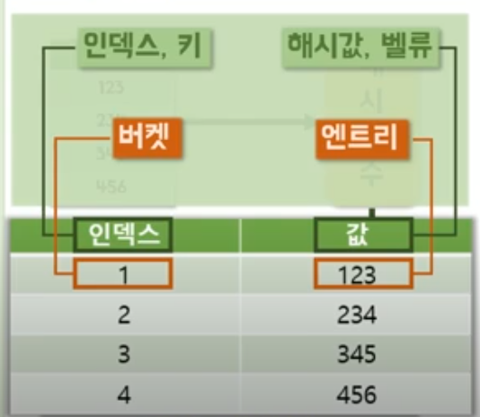

알고리즘 스터디를 시작하면서 이론을 블로그에 정리해 볼 생각이다! 
아직은 아니지만 앞으로 더 좋은 곳으로 가기위해선 코딩테스트 연습도 할겸 
비전공자로서 기본기가 부족한 모습을 보충할 겸 열공하자 🧐🤓

# 해시란?
해시, 해싱, 해시함수, 해시테이블이라고 불리며 
똑같은 데이터가 올 때마다 똑같은 분류되는 규칙을 가지고 있는다. 
해시는 리소스를 이용하여 속도를 높인다 
해시의 장점은 빠른 속도 이다

해시 충돌 : 해시 함수가 서로 다른 두 개의 이볅 값에 대해 동일한 출력값을 내는 상황을 의미한다. 
해시 함수가 무한한 가짓수의 입력 값을 받아 유한한 가짓 수의 출력 값을 생성하는 경우, 충돌은 항상 존재한다. 

해시 충돌에 대처하는 방법 : 
1. 체이닝 - 해당 인덱스에 값이 있으면 그 뒤에 체인으로 리스트 같은 자료구조를 이용해서 연결 시키는 것
2. 선형탐사 (Linear Probing) - 미리 만들어 놓은 버켓을 먼저 소모하자 , 1번 인덱스에 값이 있으면 자리가 비어있는 2번 인덱스에 값을 집어 넣는다.
3. 테이블 리사이징 - 선형탐사를 할 자리도 없으면 테이블 리사이징 한다. 기존의 데이터들을 다시 해시 함수로 보내버린다. 그리고 다시 테이블을  재정렬을 한다.