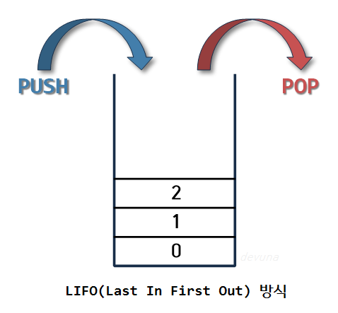
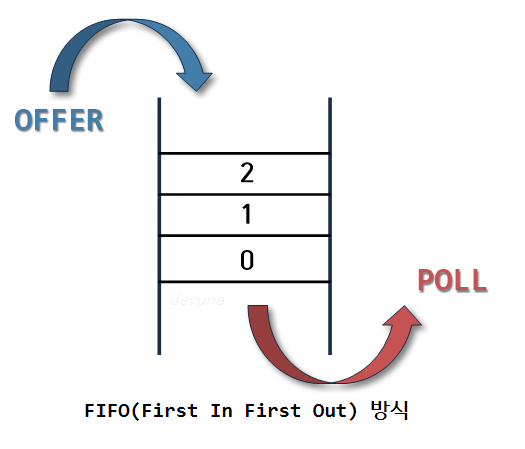
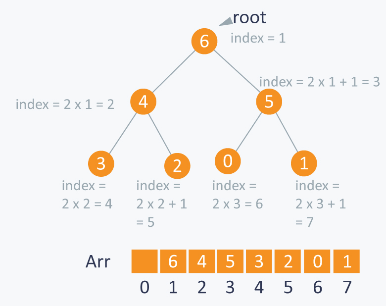
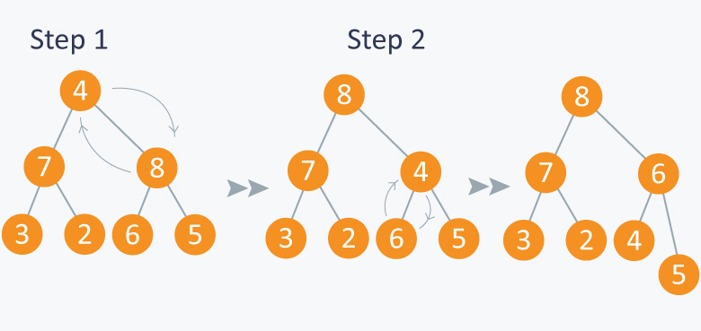

# 스택(Stack) 이란?
쌓아 올린다는것을 의미 하며 차곡차곡 쌓아 올린 형태의 자료 구조를 말한다. 

## 스택의 특징

- 같은 구조와 크기의 자료를 정해진 방향으로만 쌓을 수 있다.
- top으로 정한 곳을 통해서만 접근 할 수 있다.
- top에 가장 위에 있는 자료가 가장 최근에 들어온 자료이다.
- 삽입되는 새 자료는 top이 가리키는 자료의 위에 쌓이게 된다.
- 가장 마지막에 삽입된 자료가 가장 먼저 삭제 된다.
- LIFO, Last-In-First-Out, 후입선출 구조

---

# 큐(Queue)란?

사전적 의미는 1. (무엇을 기다리는 사람, 자동차 등의) 줄, 혹은 줄을 서서 기다리는 것을 의미하며 

선입선출 방식의 자료 구조이다. 

## 큐의 특징

- 삭제 연산만 수행되는 곳을 프론트(front)
- 삽입연산만 이루어지는 곳을 리어(rear)
- 접근 방법은 가장 첫 원소와 끝 원소로만 가능
- 가장 먼저 들어온 프론트 원소가 가장 먼저 삭제

---

# 힙(Heap) 이란?

힙, binary heap, 이진 힙이라고 불리며 
우선 순위 큐를 위하여 만들어진 자료 구조.

## 우선순위 큐란?

데이터들이 우선순위를 가지고 있고 우선순위가 높은 데이터가 먼저 나간다. 

## 힙의 특징

- 완전 이진 트리의 일종이다
- 여러개의 값들 중에 최댓값이나 최소값을 빠르게 찾아내도록 한다.
- 일종의 반정렬 상태(느슨한 정렬 상태)를 유지한다.
    - 큰 값이 상위 레벨에 있고 작은 값이 하위 레벨에 있다는 정도
- 중복된 값을 허용한다
- 각 노드는 최대 2개의 자식 노드를 가진다
- 스택과 비교 했을 때, 힙이 수행하는데 더 많은 시간이 걸린다.
- 복잡성 : O(logN)

## 힙의 예제. Array를 tree에 저장하는 예.

{6,4,5,3,2,0,1}의 value가 있을 때. 
Arr에 index i에 있는 요소를 저장한다고 하면, 부모 노트는 Arr[i/2](root가 아닐 때) 이고 
왼쪽 자식 노드는 Arr[2*i] 이고 오른쪽 자식 노트는 Arr[2*i+1]로 접근할 수 있다. 
root의 인덱스는 1이 될 것이다. 

## 힙의 종류

- 최대 힙
    - 부모 노드의 키 값이 자식 노드의 키 값보다 크거나 같은 완전 이진 트리
    - key(부모 노드) >= key(자식 노드)\

    

- 최소 힙
    - 부모 노드의 키 값이 자식 노드의 키 값보다 작거나 같은 완전 이진 트리
    - key(부모 노드) <= key(자식 노드)

