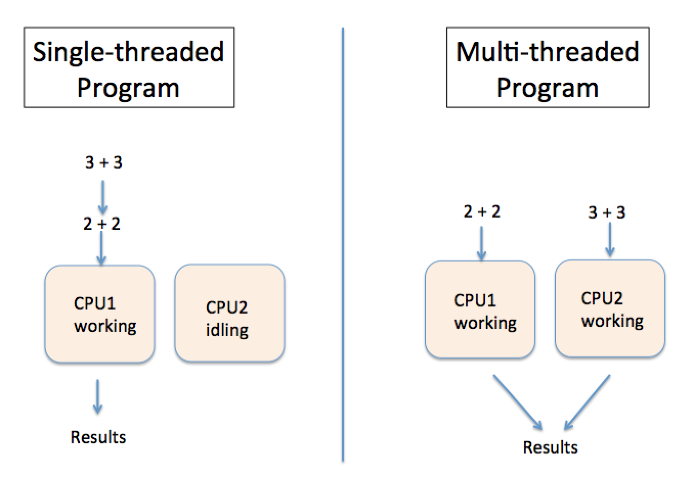

#MultiThreading

하나의 프로그램이 두 개의 메소드를 호출할때 두번째 메소드가 첫번째 메소드가 종료가 된 후에 실행이 된다면 이건 프로그램이 오직 하나의 thread를 가지고 있다고 할 수 있다. 
오늘날엔, 옛날 컴퓨터만이 하나의 프로세서를 가지고 있다. 대부분의 컴퓨터에는 적어도 두 개의 CPU와 하나의 GPU를 가지고 있다. 

하지만 하나의 프로세서도 프로그램이 multiple threads를 사용한다면 한번에 여러개의 액션을 수행할 수 있다. 하나의 자바 클래스는 프로세서의 타임슬라이스 시간을 번갈아가면서 사용할 여러개의 thread를 수행할 수 있다. 예를들어 프로그램이 유저에게 질문을 하고 대답을 기다린다. 그동안 CPU는 다른 어플리케이션 로직을 수행할 수 있다. 



멀티 쓰레드를 만드는 프로그램의 가장 좋은 예는 웹 브라우저이다. 예를 들어, 브라우저에서 웹서핑을 하는 동안 파일을 다운로드 할 수 있다. 한 프로그램(브라우저)는 두개의 thread(browsing and downloading) 를 수평적으로 수행한다.

## Thread 만들기

지금까지 만든 자바 어플리케이션은 main thread라고 불리는 곳에서 돌고 있었다. 우리는 main thread를 만들기위해 어떤 특별한 프로그래밍을 필요로 하지 않았다. Java runtime은 항상 각 프로그램에 하나의 thread를 만든다. 하지만 만약 평행 thread에서 수행하는 어플리케이션 코드를 원한다면, Java runtime에 각각의 thread를 만들고 main thread와 함께 평행적으로 수행되도록 요청하는 코드를 작성해야 한다. 

thread를 만드는데에는 다양한 방법이 있다. 

- Thread 클래스를 상속받고 run 메소드를 override 할 수 있다
- Runnable 인터페이스를 추가하고 run 메소드를 구현한다
- Thread 클래스를 상속받는 대신에 Thread object의 인스턴스를 만들 수 있다
- Callable 인터페이스를 추가하고 call 메소드를 구현한다.

multi-threading을 수행하는 가장 쉬운 방법은 lambda를 사용하는 것 이다. 추가적으로, lambda를 오직 하나의 추상 메소드를 가지고 있는 functional interface 시행을 위해 사용할 수 있다. Runnable 인터페이스는 하나의 추상 메소드 run을 선언한다. lambda로 수행이 될 수 있다. 

SingleThreadedDemo.java

```java
public class SingleThreadedDemo {
  public static void main(String[] args) {

   for (int i=0; i<5;i++){
     System.out.println("The value of i in power of 4 is "
                                             + i*i*i*i*i);
   }

   for (int k=0; k<5;k++){
      System.out.println("*** The value of k is " + k + "!");
   }

  }
}
```

output: 

```
The value of i in power of 4 is 0
The value of i in power of 4 is 1
The value of i in power of 4 is 32
The value of i in power of 4 is 243
The value of i in power of 4 is 1024
*** The value of k is 0!
*** The value of k is 1!
*** The value of k is 2!
*** The value of k is 3!
*** The value of k is 4!
```

MultiThreadedDemo.java

```java
public class MultiThreadedDemo {
  public static void main(String[] args) {

   Thread myThread = new Thread(          (1)
        () ->{                            (2)
          for (int i=0; i<5;i++){
             System.out.println("The value of i in power of 4 is " + i*i*i*i*i);
          }
        }                                 (3)
      );

   myThread.start();                      (4)

   for (int k=0; k<5;k++){
    System.out.println("*** The value of k is " + k + "!");
   }
  }
}
```

1. Thread 인스턴스를 만든다. 
2. lambda 표현식이 Runnable를 수행하기 가장 쉬운 방법이다. 
    lambda는 파라미터를 명시하지 않는다. 
    Java 컴파일러는 Thread 생성자가 Runnable 인스턴스를 원하기 때문에 lambda 표현식이 Runnable 인터페이스를 시행하고 있을 거라고 추측할 수 있다. For문은 자동적으로 run 메소드에서 돌아가는게 된다. 
3. lambda 표현식이 끝난다. 
4.  Thread의 수행을 시작하기 위해, 우리는 Thread class에 정의된 start 메서드를 불러야한다 그리고 자동적으로 run 메서드를 수행시킬 것이다. start ㅔㅁ서드는 run 메소드가 끝날 때 까지 기다리지 않아서 main 메서드의 다음 줄이 실행 된다. 

만약 MultiThreadedDemo를 여러번 돌렸다면, 출력결과가 매번 달라질 것이다.

```
*** The value of k is 0!
*** The value of k is 1!
The value of i in power of 4 is 0
The value of i in power of 4 is 1
*** The value of k is 2!
*** The value of k is 3!
*** The value of k is 4!
The value of i in power of 4 is 32
The value of i in power of 4 is 243
The value of i in power of 4 is 1024
```

첫번째 두 라인은 두번째 for문에서 수행된 것이다. 이것은 start 메서드를 부르고 나서 myThread 프로그램이 첫번째 포문이 끝나기를 기다리지 않았다는 것을 의미한다. 
그때 첫번째 반복문에 프린트해야할 것이 있었다. 그리고 두번째, 등등. 전체 콘솔 출력은 두 개의 평행 threads의 믹스이다. 

출처 : <https://yfain.github.io/Java4Kids/#_light_introduction_to_multi_threading>