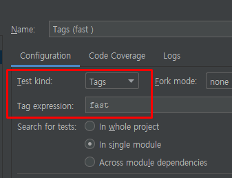

자바 개발자가 가장 많이 사용하는 테스팅 프레임워크.

- <https://www.jetbrains.com/lp/devecosystem-2019/java/>
    - “단위 테스트를 작성하는 자바 개발자 93% JUnit을 사용함.”
- 자바 8 이상을 필요로 함.
- 대체제: TestNG, Spock, ...


Platform: 테스트를 실행해주는 런처 제공. TestEngine API 제공.
Jupiter: TestEngine API 구현체로 JUnit 5를 제공.
Vintage: JUnit 4와 3을 지원하는 TestEngine 구현체.

## 기본 어노테이션

- @BeforeAll : 모든 테스트들이 진행 되기 전에 반드시 딱 한번만 호출이 됨.
    구현할 때는 반드시 static method를 사용해야함. private은 안됨. default는 됨. return은 void. 

- @afterAll: 모든 테스트들이 진행 된 후에 반드시 딱 한번만 호출이 됨.
    구현할 때는 반드시 static method를 사용해야함. private은 안됨. default는 됨. return은 void. 

- 모든 테스트를 실행할 때 각 각의 테스트를 실행하기 이전과 이후에 한번씩 호출이 되는 것.
    @BeforeEach 
    @AfterEach 
    static일 필요가 없음 

- @Disabled 실행을 하고 싶지 않은 Test가 있을 때

## 테스트 이름 표기하기

테스트를 실행하면 Report쪽에 테스트 이름이 표기가 되는데 
메소드 이름이 그대로 표기가 된다. 
메소드 이름 말고 이름을 표기하고 싶을 때 
클래스 이름 위에 : @DisplayNameGeneration(DisplayNameGenerator.ReplaceUnderscores.class)
메소드 이름 위에 : @DisplayName("스터디 만들기 \uD83D\uDE31")

## Assertion

- assertion은 assertNotNull같은 메소드를 사용해서
    테스트에서 검증하고자 하는 것을 확인 하는것

- public static void assertEquals(Object expected, Object actual, String message)
    assertEqauls(기대하는 값, 실제 나오는 값, 메시지) 

- 여러개의 assert문을 확인 하기 위해서 assertAll()로 묶어 주기

- Exception이 발생하는 것을 확인하는 방법
    assertThrows(IllegalArgumentException.class, () -> new Study(-10));
    aseertThrows(어떤 종류의 exception, 언제) 

- assertTimeout() 실행하고자 하는 app이 시간안에 실행이 되는지 확인
    assertTimeoutPreemptively() 먼저 테스트를 실행하고 테스트가 timeout 땡치는 순간 테스트를 종료시키는 메소드이다. 

## 조건에 따라 테스트 실행하기

특정한 조건을 만족하는 경우에 테스트를 실행하는 방법. 

- assumeTrue(조건)
- assumingThat(조건, 테스트) 처음에 조건을 주고 조건에 만족하면 그때는 테스트를 한다.

- 메소드 위에 어노테이션으로 조건을 줄 수도 있다.

     @Enabled___ 와 @Disabled___

    - OnOS(os.MAC, os.WINDOWS)
    - OnJre({JRE.JAVA_8, JRE.JAVA_9})
    - IfSystemProperty
    - IfEnvironmentVariable(named = "TEST_ENV", matches = "LOCAL")
    - ~~If~~

## 태깅과 필터링

테스트 그룹을 만들고 원하는 테스트 그룹만 테스트를 실행할 수 있는 기능

@Tag("태그") 

Edit Configuration → Test Kind



메이븐에서 필터 활성화 하는 방법 pom.xml

```bash
<plugin>
    <artifactId>maven-surefire-plugin</artifactId>
    <configuration>
        <groups>fast | slow</groups>
    </configuration>
</plugin>
```

## 커스텀 태그

JUnit 5 애노테이션을 조합하여 커스텀 태그를 만들 수 있다.

메타 애노테이션을 사용할 수 있다. 

우리가 커스텀한 에노테이션을 만들때 우리가 만든 애토이션을 사용하더라도 

동일한 기능이 적용이 된다고 한다. 

```java
@Target(ElementType.METHOD) //이 애노테이션을 METHOD에 쓸 수 있다는 의미
@Retention(RetentionPolicy.RUNTIME) // 이 애노테이션을 사용한 코드가 RUNTIME까지 유지가 되야한다는 의미
@Test
@Tag("fast") //이 애노테이션을 사용하면 Tag는 fast 이다.
public @interface FastTest {
    //여러개의 에노테이션을 조합한 composed annotation을 만들었다 

}
```

## 테스트 반복하기

@RepeatedTest

- 반복 횟수와 반복 테스트 이름을 설정할 수 있다.
    - {displayName}
    - {currentRepetition}
    - {totalRepetitions}
- RepetitionInfo 타입의 인자를 받을 수 있다.

```java
@DisplayName("스터디 만들기")
@RepeatedTest(value = 10, name = "{displayName}, {currentRepetition}/{totalRepetitions}")
void repeatTest(RepetitionInfo repotitionInfo){
    System.out.println("test" + repotitionInfo.getCurrentRepetition() + "/" + repotitionInfo.getTotalRepetitions());
}
```

@ParameterizedTest 

- 테스트를 할 때마다 다른 값을 가지고 테스트를 하고 싶다.
- 테스트에 여러 다른 매개변수를 대입해가며 반복 실행한다.
    - {displayName}
    - {index}
    - {arguments}
    - {0}, {1}, ...

    ```java
    @DisplayName("스터디 만들기")
    @ParameterizedTest(name = "{index} {displayName} message = {0}")
    @ValueSource(strings = {"날씨가", "많이","추워"})
    void parameterizedTest(String message){
      System.out.println(message);
    }
    ```

```java
@DisplayName("스터디 만들기")
@ParameterizedTest(name = "{index} {displayName} message = {0}")
@ValueSource(ints = {10, 20, 30})
void parameterizedTest(Integer limit){
    System.out.println(limit);
}
```

인자 값들의 소스

- @ValueSource
- @NullSource, @EmptySource, @NullAndEmptySource

    Empty 값, Null 값을 넣어주는 애노테이션

- @EnumSource
- @MethodSource
- @CvsSource
- @CvsFileSource
- @ArgumentSource

인자 값 타입 변환

- 암묵적인 타입 변환
    - [레퍼런스](https://junit.org/junit5/docs/current/user-guide/#writing-tests-parameterized-tests-argument-conversion-implicit) 참고
- 명시적인 타입 변환
    - SimpleArgumentConverter 상속 받은 구현체 제공
    - @ConvertWith //하나의 argument를 바꿀 때만 적용

    ```java
    @DisplayName("스터디 만들기")
    @ParameterizedTest(name = "{index} {displayName} message = {0}")
    @ValueSource(ints = {10, 20, 30})
    void parameterizedTest(@ConvertWith(StudyConverter.class) Study study){
        System.out.println(study.getLimit());
    }

    static class StudyConverter extends SimpleArgumentConverter {
        @Override
        protected Object convert(Object source, Class<?> aClass) throws ArgumentConversionException {
            assertEquals(Study.class, aClass, "Can only convert to Study");
            return new Study(Integer.parseInt(source.toString()));
        }
    }
    ```

인자 값 조합

- ArgumentsAccessor

```java
@DisplayName("스터디 만들기")
@ParameterizedTest(name = "{index} {displayName} message = {0}")
@CsvSource({"10, '자바 스터디'", "20, '스프링'"})
void parameterizedTest(ArgumentsAccessor argumentsAccessor){
    Study study = new Study(argumentsAccessor.getInteger(0), argumentsAccessor.getString(1));
    System.out.println(study);
}
```

- 커스텀 Accessor
    - ArgumentsAggregator 인터페이스 구현, 반드시 static inner class이거나 public class 형태로 만들어야 함.
    - @AggregateWith

    ```java
    @DisplayName("스터디 만들기")
    @ParameterizedTest(name = "{index} {displayName} message = {0}")
    @CsvSource({"10, '자바 스터디'", "20, '스프링'"})
    void parameterizedTest(@AggregateWith(StudyAggregator.class) Study study){
        System.out.println(study);
    }

    static class StudyAggregator implements ArgumentsAggregator{

        @Override
        public Object aggregateArguments(ArgumentsAccessor argumentsAccessor, ParameterContext parameterContext) throws ArgumentsAggregationException {
            return new Study(argumentsAccessor.getInteger(0), argumentsAccessor.getString(1));
        }
    }
    ```


## 테스트 인스턴스

JUnit은 테스트 메소드 마다 테스트 인스턴스를 새로 만든다.

- 이것이 기본 전략.
- 테스트 메소드를 독립적으로 실행하여 예상치 못한 부작용을 방지하기 위함이다.
- 테스트 간의 의존성을 없애기 위함이다.
- 이 전략을 JUnit 5에서 변경할 수 있다.

@TestInstance(Lifecycle.PER_CLASS)

- 테스트 클래스당 인스턴스를 하나만 만들어 사용한다.
- 경우에 따라, 테스트 간에 공유하는 모든 상태를 @BeforeEach 또는 @AfterEach에서 초기화 할 필요가 있다. (static이 아니어도 된다.)
- @BeforeAll과 @AfterAll을 인스턴스 메소드 또는 인터페이스에 정의한 default 메소드로 정의할 수도 있다.

## 테스트 순서

실행할 테스트 메소드 특정한 순서에 의해 실행되지만 어떻게 그 순서를 정하는지는 의도적으로 분명히 하지 않는다. (테스트 인스턴스를 테스트 마다 새로 만드는 것과 같은 이유)

경우에 따라, 특정 순서대로 테스트를 실행하고 싶을 때도 있다. 그 경우에는 테스트 메소드를 원하는 순서에 따라 실행하도록 @TestInstance(Lifecycle.PER_CLASS)와 함께 @TestMethodOrder를 사용할 수 있다.

- MethodOrderer 구현체를 설정한다.
- 기본 구현체
    - Alphanumeric
    - OrderAnnoation
    - Random

## junit-platform.properties

JUnit 설정 파일로, 클래스패스 루트 (src/test/resources/)에 넣어두면 적용된다.


Project Structure에서 Test Resources로 설정해주어야 한다. 


테스트 인스턴스 라이프사이클 설정
junit.jupiter.testinstance.lifecycle.default = per_class

확장팩 자동 감지 기능
junit.jupiter.extensions.autodetection.enabled = true

@Disabled 무시하고 실행하기
junit.jupiter.conditions.deactivate = org.junit.*DisabledCondition테스트 이름 표기 전략 설정
junit.jupiter.displayname.generator.default = \
org.junit.jupiter.api.DisplayNameGenerator$ReplaceUnderscores


## 확장 모델

JUnit 4의 확장 모델은 @RunWith(Runner), TestRule, MethodRule.

JUnit 5의 확장 모델은 단 하나, Extension.

```java
public class FindSlowTestExtension implements BeforeTestExecutionCallback, AfterTestExecutionCallback {

    private static final long THRESHOLD = 1000L;

    @Override
    public void beforeTestExecution(ExtensionContext extensionContext) throws Exception {
        //파라미터로 받는 extentionContext에는 어떤 값들을 저장할 수 있는 store라는 개념이 있음
        ExtensionContext.Store store = getStore(extensionContext);
        store.put("START TIME", System.currentTimeMillis());
    }

    @Override
    public void afterTestExecution(ExtensionContext extensionContext) throws Exception {
        Method requiredTestMethod = extensionContext.getRequiredTestMethod();
        SlowTest annotation = requiredTestMethod.getAnnotation(SlowTest.class);

        String testMethodName = extensionContext.getRequiredTestClass().getName();
        ExtensionContext.Store store = getStore(extensionContext);

        long start_time = store.remove("START TIME", long.class);
        long duration = System.currentTimeMillis() - start_time;
        if (duration > THRESHOLD && annotation == null){
            System.out.printf("Please consider mark method [%s] with @SlowTest.\n", testMethodName);
        }

    }

    private ExtensionContext.Store getStore(ExtensionContext context){
        String testClassName = context.getRequiredTestClass().getName();
        String testMethodName = context.getRequiredTestClass().getName();
        return context.getStore(ExtensionContext.Namespace.create(testClassName, testMethodName));

    }
}
```

확장팩 등록 방법

- 선언적인 등록 @ExtendWith
- 프로그래밍 등록 @RegisterExtension

    ```java
    @RegisterExtension
        static FindSlowTestExtension findSlowTestExtension = new FindSlowTestExtension(1000L);
    ```

- 자동 등록 자바 [ServiceLoader](https://docs.oracle.com/en/java/javase/11/docs/api/java.base/java/util/ServiceLoader.html) 이용

확장팩 만드는 방법

- 테스트 실행 조건
- 테스트 인스턴스 팩토리
- 테스트 인스턴스 후-처리기
- 테스트 매개변수 리졸버
- 테스트 라이프사이클 콜백
- 예외 처리
- ...


## 마이그레이션

junit-vintage-engine을 의존성으로 추가하면, JUnit 5의 junit-platform으로 JUnit 3과 4로 작성된 테스트를 실행할 수 있다.

- @Rule은 기본적으로 지원하지 않지만, junit-jupiter-migrationsupport 모듈이 제공하는 @EnableRuleMigrationSupport를 사용하면 다음 타입의 Rule을 지원한다.
    - ExternalResource
    - Verifier
    - ExpectedException

| JUnit4                                     | JUnit5                                         |
|--------------------------------------------|------------------------------------------------|
| @Category(Class)                           | @Tag(String)                                   |
| @RunWith, @Rule, @ClassRule                | @ExtendWith, @RegisterExtention                |
| @Ignore                                    | @Disabled                                      |
| @Before, @After, @BeforeClass, @AfterClass | @BeforeEach, @AfterEach, @BeforeAll, @AfterAll |


## 연습문제

1. 테스트 이름을 표기하는 방법으로 공백, 특수 문자 등을 자유롭게 쓸 수 있는 애노테이션은?
**DisplayName**

2. JUnit 5, jupiter는 크게 세가지 모듈로 나눌 수 있습니다. 다음 중에서 테스트를 실행하는 런처와 테스트 엔진의 API를 제공하는 모듈은 무엇일까요?

① junit jupiter ② junit vintage **③ junit platform**

3. JUnit 5에서 테스트 그룹을 만들고 필터링 하여 실행하는데 사용하는 애노테이션은?

Tag

4. 다음 코드는 여러 Assertion을 모두 실행하려는 테스트 코드입니다. 빈칸에 적절한 코드는 무엇인가요?  AssertAll

```java
@Test
@DisplayName("스터디 만들기")
void create_new_study() {
    Study actual = new Study(1, "테스트 스터디");
    ________(
        () -> assertEquals(1, actual.getLimit()),
        () -> assertEquals("테스트 스터디", actual.getName()),
        () -> assertEquals(StudyStatus.DRAFT, actual.getStatus())
    );
}
```

5. 다음은 JUnit 5가 제공하는 애노테이션으로 컴포짓 애노테이션을 만드는 코드입니다. 이 애노테이션에 적절한 Rention 전략은 무엇인가요? RetentioPolicy.RUNTIME 

```java
@Target(ElementType.METHOD)
@Retention(______________)
@Test
@Tag("fast")
public @interface FastTest {
}
```

6. 다음 중 JUnit 5가 제공하는 확장팩 등록 방법이 아닌것은?
① @ExtendWith
**② @Rule**
③ @RegisterExtension
④ ServiceLoader

7. 다음 코드는 유즈케이스 테스트를 작성한 것입니다. 다음 빈 칸에 적절한 코드는?
PER_CLASS

```java
@TestInstance(TestInstance.Lifecycle.________)
@TestMethodOrder(MethodOrderer.___________.class)
public class StudyCreateUsecaseTest {

    private Study study;

    @Order(1)
    @Test
    @DisplayName("스터디 만들기")
    public void create_study() {
        study = new Study(10, "자바");
        assertEquals(StudyStatus.DRAFT, study.getStatus());
    }

    @Order(2)
    @Test
    @DisplayName("스터디 공개")
    public void publish_study() {
        study.publish();
        assertEquals(StudyStatus.OPENED, study.getStatus());
        assertNotNull(study.getOpenedDateTime());
    }

}
```

8. 다음은 여러 매개변수를 바꿔가며 동일한 테스트를 실행하는 코드입니다. 빈칸에 적잘한 코드는?

ParameterizedTest
AggregateWith

```java
@Order(4)
@DisplayName("스터디 만들기")
@________________(name = "{index} {displayName} message={0}")
@CsvSource({"10, '자바 스터디'", "20, 스프링"})
void parameterizedTest(@___________(StudyAggregator.class) Study study) {
    System.out.println(study);
}

static class StudyAggregator implements ArgumentsAggregator {
    @Override
    public Object aggregateArguments(ArgumentsAccessor accessor, ParameterContext context) throws ArgumentsAggregationException {
        return new Study(accessor.getInteger(0), accessor.getString(1));
    }
}
```

참고 Docs : <https://docs.google.com/document/d/1j6mU7Q5gng1mAJZUKUVya4Rs0Jvn5wn_bCUp3rq41nQ/edit#heading=h.emh58h3nn0s8>, <0https://junit.org/junit5/docs/current/user-guide/>, <https://junit.org/junit5/docs/current/user-guide/#extensions> <https://junit.org/junit5/docs/current/user-guide/#writing-tests-parameterized-tests>
