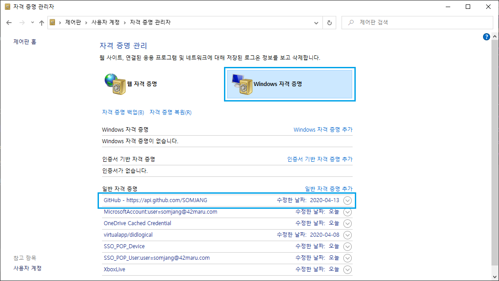
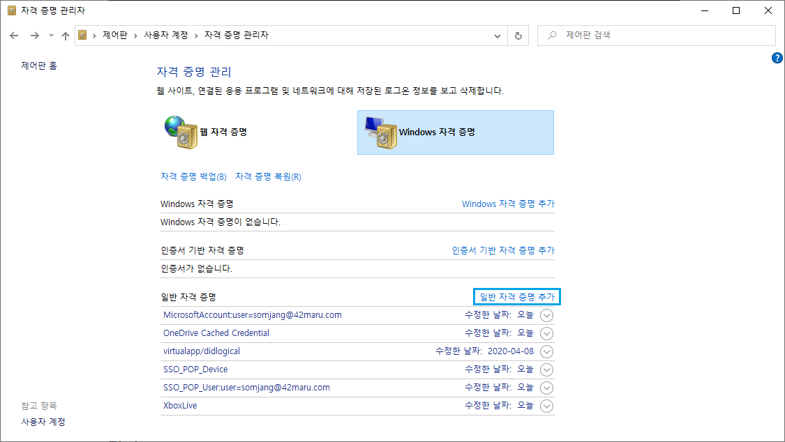
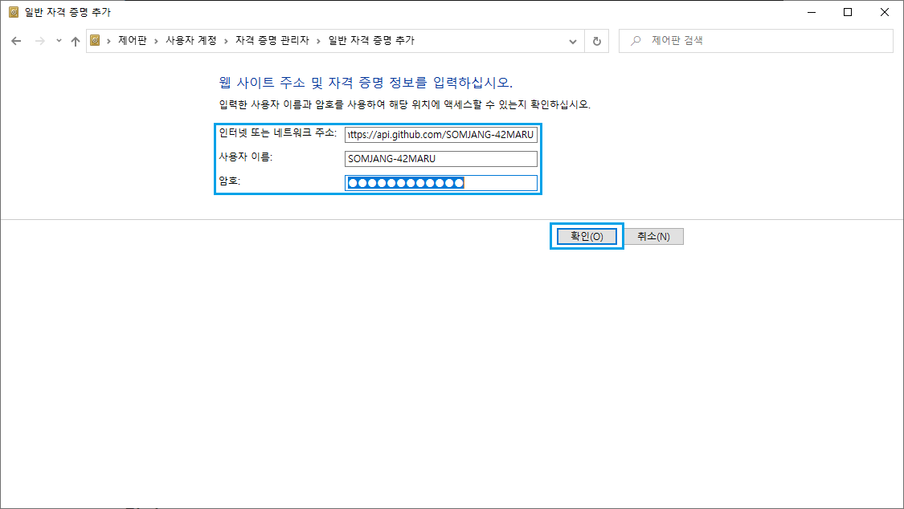

Windows10에서 Git Bash로 github 포스팅을 올리는데 
내 부계정으로 commit이 되고 주계정으로 commit이 안된다😥
부계정은 연막작전으로 만들어 놓은거라서 주계정으로만 commit 하고 싶은데... 
그래서 찾아보았다. Git Bash에서 터미널 계정 바꾸는 방법! 

## 1. 현재 설정된 계정 정보 확인

```java
$ git config user.name
$ git config user.email
```

## 2. 명령어를 통해 계정 바꾸기

```java
$ git config --global user.name 변경을 희망하는 계정
$ git config --global user.email 변경을 희망하는 이메일
```

## 3. Windows 자격증명 수정하기

제어판 > 사용자 계정 > 자격 증명 관리 > Windows 자격 증명 > github항목 삭제 후 수정

github 자격 증명을 삭제 한 후 일반 자격 증명 추가로 새로 추가한다. 







인터넷 또는 네트워크 주소 : https://eunmik.github.com/eunmik

사용자 이름 : eunmik1022


