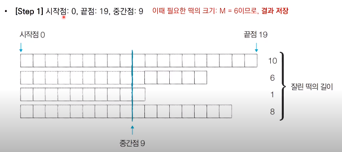
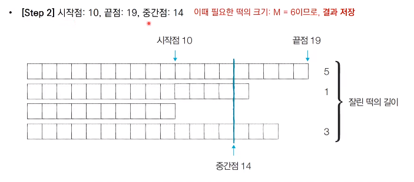
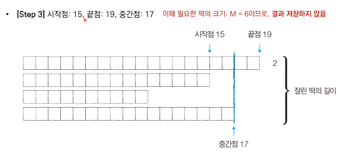
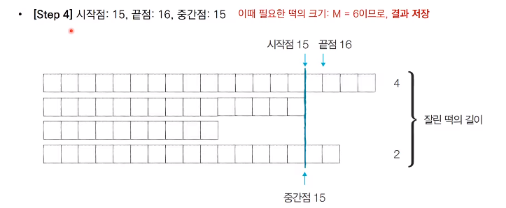
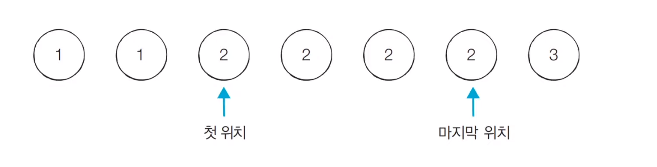

# [Algorithm] 이분 탐색

## 이진 탐색 알고리즘

- 순차 탐색 : 리스트 안에 있는 특정한 데이터를 찾기 위해 앞에서부터 데이터를 확인하는 방법
- 이진 탐색 : 정렬되어 있는 리스트에서 탐색 범위를 절반씩 좁혀가며 데이터를 탐색하는 방법
    - 이진 탐색은 시작점, 끝점, 중간점을 이용하여 탐색 범위를 설정합니다.


## 이진 탐색의 시간 복잡도

- 단계마다 탐색 범위를 2로 나누는 것과 동일하므로 연산 횟수는 $log_2 N$에 비례합니다.
- 예를 들어 초기 데이터 개수가 32개일 때, 이성적으로 1단계를 거치면 16개 가량의 데이터만 납습니다.
    - 2단계를 거치면 8개가량의 데이터만 남습니다.
    - 3단계를 거치면 4개 가량의 데이터만 남습니다.
- 다시 말해 이진 탐색은 탐색 범위를 절반씩 줄이며, 시간 복잡도는 $O(logN)$을 보장합니다.

## 이진 탐색 코드 (JAVA)

```java
// Java implementation of recursive Binary Search
class BinarySearch {
    // Returns index of x if it is present in arr[l..
    // r], else return -1
    int binarySearch(int arr[], int l, int r, int x)
    {
        if (r >= l) {
            int mid = l + (r - l) / 2;
 
            // If the element is present at the
            // middle itself
            if (arr[mid] == x)
                return mid;
 
            // If element is smaller than mid, then
            // it can only be present in left subarray
            if (arr[mid] > x)
                return binarySearch(arr, l, mid - 1, x);
 
            // Else the element can only be present
            // in right subarray
            return binarySearch(arr, mid + 1, r, x);
        }
 
        // We reach here when element is not present
        // in array
        return -1;
    }
 
    // Driver method to test above
    public static void main(String args[])
    {
        BinarySearch ob = new BinarySearch();
        int arr[] = { 2, 3, 4, 10, 40 };
        int n = arr.length;
        int x = 10;
        int result = ob.binarySearch(arr, 0, n - 1, x);
        if (result == -1)
            System.out.println("Element not present");
        else
            System.out.println("Element found at index " + result);
    }
}
/* This code is contributed by Rajat Mishra */
```

## 파라메트릭 서치(Parametric Search)

- **파라메트릭 서치**란 최적화된 문제를 결정 문제('예' 혹은 '아니오')로 바꾸어 해결하는 기법입니다.
    - 예시: 특정한 조건을 만족하는 가장 알맞는 값을 빠르게 찾는 최적화 문제
- 일반적으로 코딩테스트에서 파라메트릭 서치 문제는 **이진 탐색을 이용하여 해결**할 수 있습니다.

## 동빈나 이진 탐색 연습 문제

### <문제> 떡볶이 떡 만들기

```
떡볶이 떡 만들기
오늘 동빈이는 여행 가신 부모님을 대신해서 떡집 일을 하기로 했습니다.
동빈이네 떡볶이 떡은 재밌게도 떡볶이 떡의 길이가 일정하지 않습니다.
대신에 한 봉지 안에 들어가는 떡의 총 길이는 절단기로 잘라서 맞춰줍니다.
절단기에 높이(H)를 지정하면 줄지어진 떡을 한 번에 절답합니다.
높이가H보다 긴 떡온H위의 부분이 잘릴 것이고,낮은 떡은 잘리지 않습니다.
예를 들어 높이가19, 14, 10, 17cm인 떡이 나란히 있고 절단기 높이를15cm로 지정하면 자른 뒤 떡의 높이는15,14,10,15cm가 될 것입니다.잘린 떡의 길이는 차례대로4,0,0,2cm입니다.
손닙은6cm만큼의 길이를 가져갑니다. 손님이 왔을 때 요청한 총 길이가M일 때 적어도M만큼의 떡을 얻기 위해 절단기에 설정할 수 있는 높이의 최댓값을 구하는 프로그램을 작성하세요.

입력 조건
첫째 줄에 떡의 개수N과 요청한 떡의 길이M이 주어집니다.
 (1 <= N <= 1,000,000 1<=M<=2,000,000,000)
둘째 줄에는 떡의 개별 높이가 주어집니다.
떡 높이의 총합은 항상M이상이므로,손님은 필요한 양만큼 떡을 사갈 수 있습니다.
높이는10억보다 작거나 같은 양의 정수 또는0입니다.
```

### 문제 해결 아이디어

- 적절한 높이를 찾을 때 까지 이진 탐색을 수행하여 높이 H를 반복해서 조정하면 됩니다.
- '현재 이 높이로 자르면 조건을 만족할 수 있는가?'를 확인한 뒤에 조건의 만족 여부('예' 혹은 '아니오')에 따라서 탐색 범위를 좁혀서 해결할 수 있습니다.
- 절단기의 높이는 0부터 10억까지의 정수 중 하나입니다.
    - 이렇게 큰 탐색 범위를 보면 가장 먼저 **이진 탐색**을 떠올려야 합니다.
- 문제에서 제시된 예시를 통해 그림으로 이해해 봅시다.

 </br>
 </br>
 </br>
 </br>

- 이러한 이진 탐색 과정을 반복하면 답을 도출할 수 있습니다.
- 중간점의 값은 시간이 지날 수록 '**최적화된 값**'이 되기 때문에, 과정을 반복하면서 얻을 수 있는 떡의 길이 합이 필요한 떡의 길이보다 크거나 같을 때마다 **중간점의 값을 기록**하면 됩니다.

### <문제> 정렬된 배열에서 특정 수의 개수 구하기

```java
N개의 원소를 포함하고 있는 수열이 오름차순으로 정렬되어 있습니다. 이때 이 수열에서 X가 등장하는 횟수를 계산하세요. 예를 들어 수열 {1,1,2,2,2,3}이 있을 때 x=2라면, 현재 수열에서 값이 2인 원소가 4개이므로 4를 출력합니다. 
단, 이문제는 시간 복잡도O(logN)으로 알고리즘을 설계하지 않으면 시간 초과 판정을 받습니다. 

입력 조건
첫째줄에서 N과 x가 정수 형태로 공백으로 구본되어 입력됩니다.
둘째줄에 N개의 원소가 정수 형태로 공백으로 구분되어 입력됩니다. 
수열의 원소 중에서 값이 x인 원소의 개수를 출력합니다. 
단, 값이 x인 원소가 하나도 없다면 -1을 출력합니다. 
```

### 문제 해결 아이디어

- 시간 복잡도 $O(logN)$으로 동작하는 알고리즘을 요구하고 있습니다.
    - 일반적인 선형 탐색로는 시간 초과 판정을 받습니다.
    - 하지만 데이터가 정렬되어 있기 때문에 이진 탐색을 수행할 수 있습니다.
- 특정 값이 등장하는 첫 번째 위치와 마지막 위치를 찾아 위치 차이를 계산해 문제를 해결할 수 있습니다.

 </br>